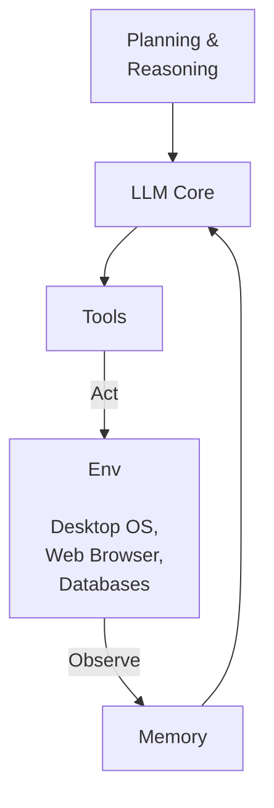

# Lecture 1 — Foundations & Landscape: What Are Agentic Systems?

- Date: 2026-09-23
- Source: https://cs329z.stanford.edu · https://www.youtube.com/watch?v=DGI4vucR71w

## Anatomy of an agent

```mermaid
flowchart TD
    P["Planning &<br/>Reasoning"] --> L["LLM Core"]
    M["Memory"] --> L
    L --> T["Tools"]
    T -- Act --> E["Env<br/><br/>Desktop OS,<br/>Web Browser,<br/>Databases"]
    E -- Observe --> M
```
